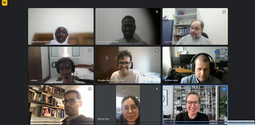
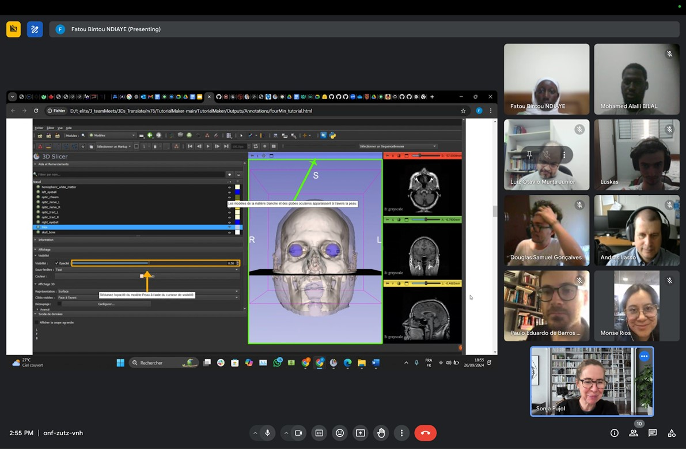

  <a href="Index" style="margin-right: 10px; text-decoration:none;">
    <button style="padding:10px 20px; color:#28a745; border:2px solid #28a745; border-radius:5px; background:none; cursor:pointer;">
      Internationalization
    </button>
  </a>
  <a href="TutorialMakerTool" style="margin-right: 10px; text-decoration:none;">
    <button style="padding:10px 20px; color:#ffc107; border:2px solid #ffc107; border-radius:5px; background:none; cursor:pointer;">
      Tutorial Maker tool
    </button>
  </a>
  <a href="ProfessionalEvents" style="text-decoration:none;">
    <button style="padding:10px 20px; color:#007BFF; border:2px solid #007BFF; border-radius:5px; background:none; cursor:pointer;">
      Events
    </button>
  </a>

  
   <a href="Collaboration" style="margin-right: 10px; text-decoration:none;">
    <button style="padding:10px 20px; color: #8B4513; border:2px solid  #8B4513; border-radius:5px; background:none; cursor:pointer;">
      Collaborations
    </button>
  </a>

 Collaborations

## **Collaborations and diversity**

  
 41st Slicer Project Week

 In this PW were meetings with the African team from the Internationalization team in order to discuss aspects related to the Tutorial Maker, where in the next months they collaborated with the evaluation of the Tutorial Maker tool.

Since August 2024 were collaborative working session between the  Slicer Internationalization team and the Slicer for Latin America team, with a total of eigth online meetings, obtaining two reports with feedback from the use of the Tutorial Maker (See the evaluation section of the <a href="TutorialMakerTool" style="margin-right: 10px; text-decoration:none;">Tutorial Maker tool).</a>

  
 CZI Community Building

The team, rooted in the cultural context of Latin America, has gained substantial benefits from the training activities provided by CZI’s open science community, particularly through its webinars. These sessions have strengthened both individual and collective capacities, enhancing team cohesion—essential for projects spanning multiple countries. The webinars kept the team informed about technological advancements and innovative strategies, fostering critical thinking and clear communication. We completed over 25 courses covering a wide range of topics, from integrating AI tools and leadership strategies to time management and data visualization, significantly enriching their skills and collaborative abilities.
 
Additionally, the webinars addressed important themes like linguistic justice and visual design, promoting inclusive and effective participation within a multilingual team. Sessions offered in both English and Spanish highlighted the balance between positive reinforcement and constructive criticism while emphasizing the importance of data privacy when using generative AI tools. Through practical examples and applicable approaches, the team has improved its decision-making, communication, and meeting organization. Overall, the webinars have not only advanced their technical skills but also strengthened their ability to work cohesively as a multicultural team, aligning with their goals of cultural and intellectual outreach using innovative tools like 3D Slicer.

  
Diversity and equity

As a Latin American team, we have prioritized Diversity, Equity, and Inclusion (DEI) within our 3D Slicer project, focusing on expanding participation in Brazil and Mexico. In Brazil, the inclusion of Prof. Dr. Mirela Teixeira Cazzolato, specializing in computer-aided healthcare methods, has led to the development of new features like a Portuguese interface and tutorial modules, while also increasing female representation. The team’s leader, Prof. Luiz Murta, who has a motor disability, exemplifies inclusivity in leadership, and the addition of Paulo Guilherme, a computer science student from northeastern Brazil, enhances geographic diversity. Similarly, in Mexico, six female professors and students from UAEM joined the project, contributing to AI, medical imaging, and virtual reality applications, thereby strengthening gender balance and fostering female leadership in technical roles.
 
Efforts in both countries ensured fair access to resources and opportunities for participants from diverse regions and institutions, including workshops in local languages. In Brazil, this included genre-balanced hackathons and training with institutions like UFRJ and Unicamp, while Mexico focused on workshops for UAEM’s Biomedical Engineering program and promoting linguistic justice. By integrating DEI into all aspects of the project, the team has created a respectful and inclusive environment, enabling broader access to 3D Slicer and fostering a collaborative, multicultural community committed to advancing healthcare technology.

