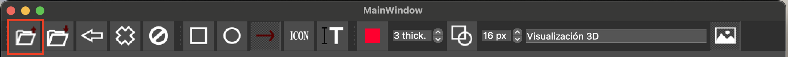
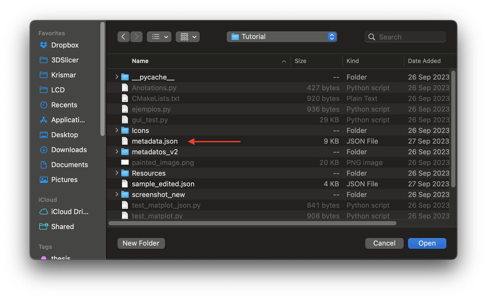
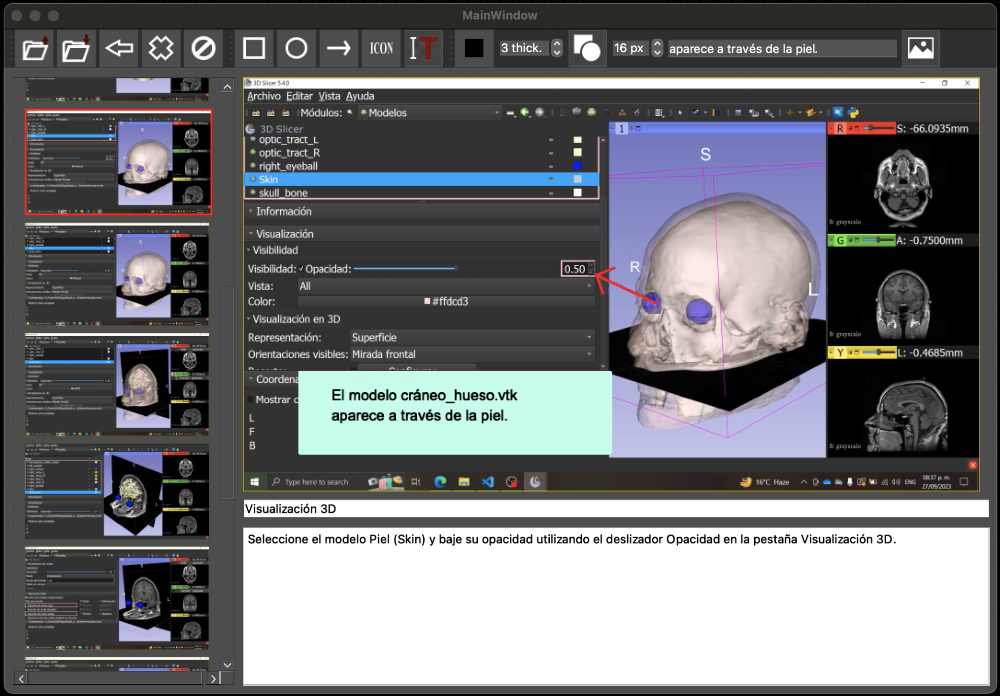

## Metadata Acquisition Tool

Requirements:
- Python 3
- PyQt5 and qt
- pyautogui
- slicer

Execute on the Slicer Python console(CTRL + 3) the next command:

Obs: Dont forget to change the EXTENSION PATH at the fourth command
```
import pip
pip.main(['install', 'pyautogui', 'PyQt5'])
exec(open('EXTENSION PATH/metadata_gui.py').read())
```

This program will allow you to capture metadata which includes a JSON with the record of the selected widget and screenshots, this JSON file will be used in the GUI stage (described below). The programming logic of metadata_gui.py is represented as follows.

 


## GUI 

Requirements:
- Python 3
- Qt 5

Execute on the terminal, inside the "Tutorial" folder, execute the next command:

```
pip install pyautogui PyQt5 imutils opencv-python
python gui_test.py
```

Load the metadata by clicking the open button in the toolbar. Select a JSON file with the metadata(that file exists in the folder "screenshot_new" inside the Slicer installation path) and an image path.




To add annotations you must select an image in the screenshot carousel. You can use the commands on the toolbar to drag and drop the mouse over the image to paint the annotations.



Generate a JSON file to save the annotations for the next step, by clicking the save command on the toolbar.


## Create PDF

Requirements:
- Python 3
- Node js 18
- Marp

Execute the sequence commands on the terminal inside the "PDF_creator" folder:
```
python demo_june.py
```
This command creates a Markdown file with slides from the tutorial.


Then execute the command marp to convert the Markdown file to html file. This file can be used to upload on a web page.
```
npm i -g @marp-team/marp-cli
marp output_tutorial.md --html output_tutorial.html
```

Finally, execute the command to install the JS libraries and the JS script to convert the html file to PDF.
```
npm install
node convertToPDF.js
```
