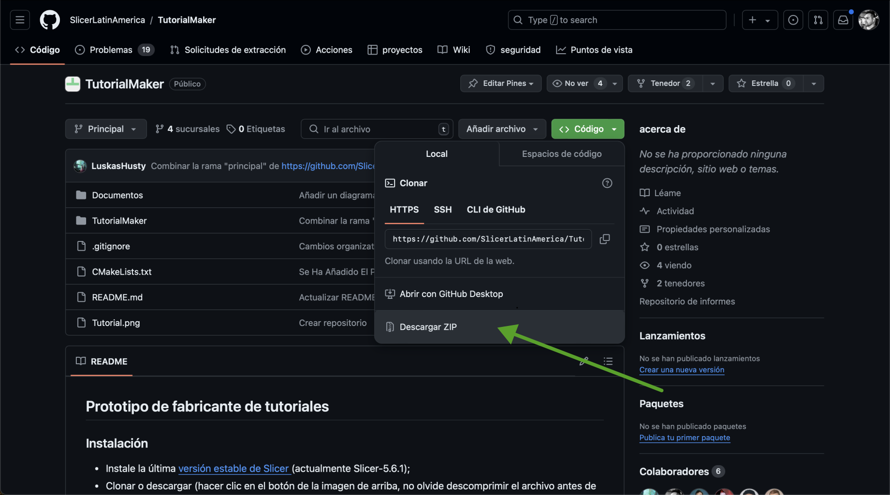
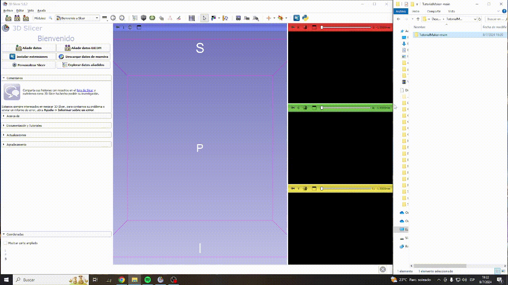
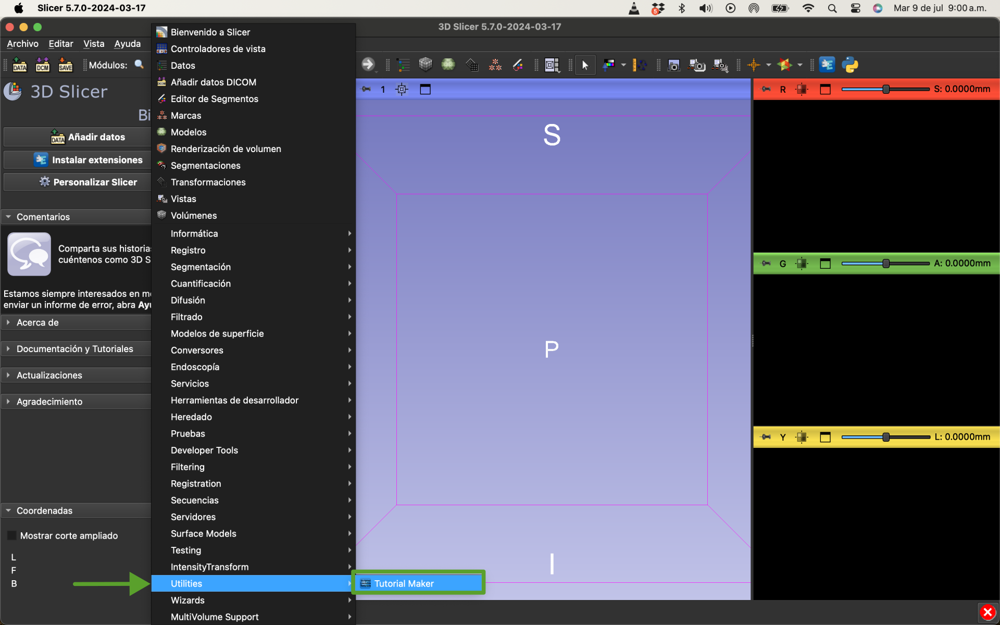
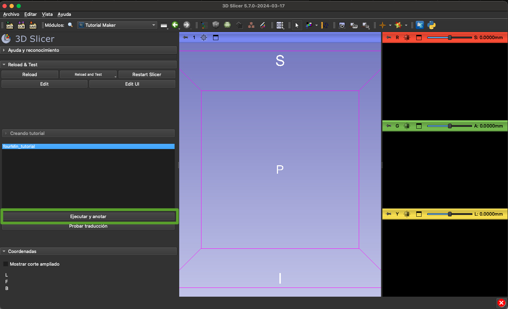
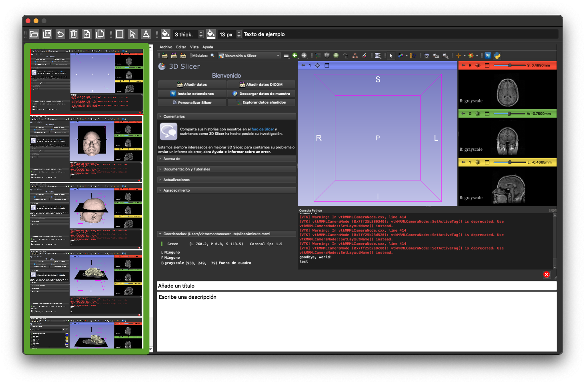
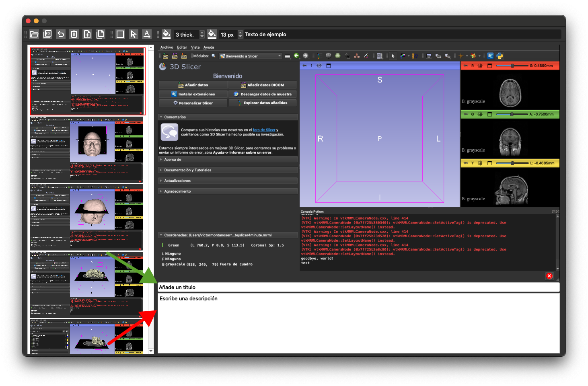
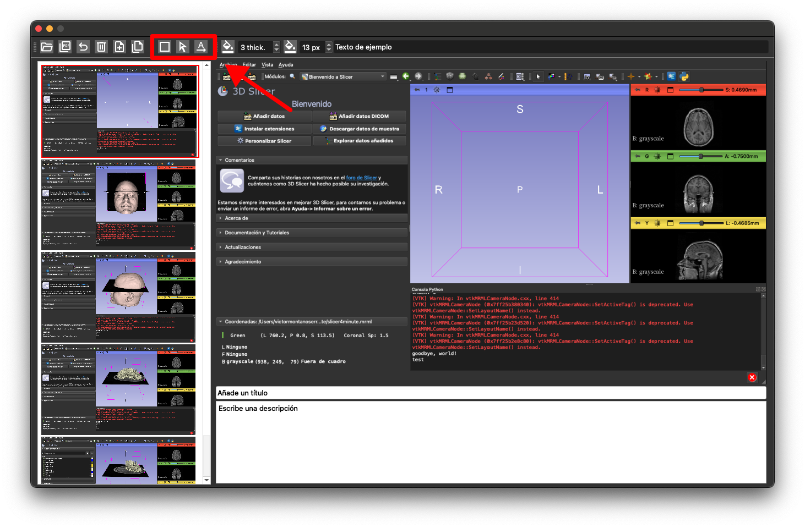
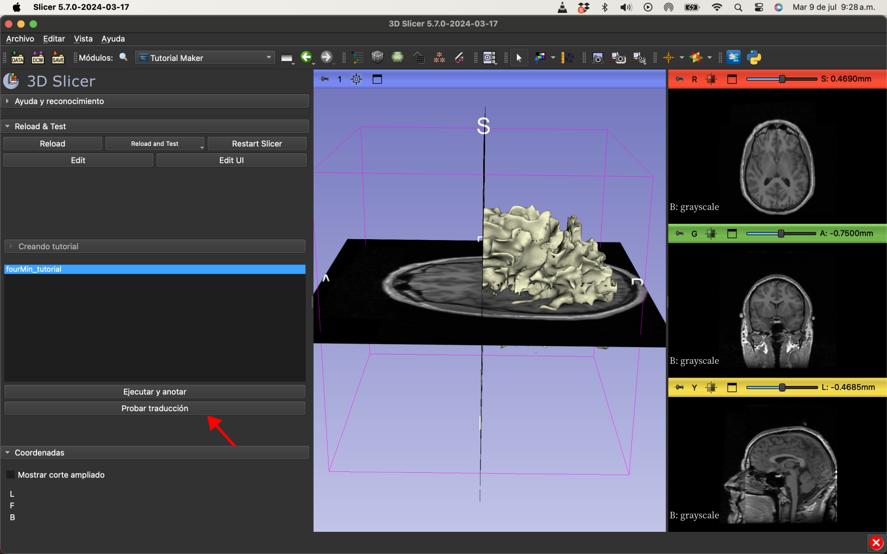

## Prototipo de Tutorial Maker 

### Instalación

- Instale la última [versión estable de Slicer](https://download.slicer.org) (actualmente Slicer-5.6.1);
- Clone o descargue (haciendo clic en el botón de la imagen de arriba, no olvide descomprimir el archivo antes de continuar) [este repositorio](https://github.com/SlicerLatinAmerica/TutorialMaker) en cualquier lugar de su equipo;

- Para usuarios de Windows: Abra 3D Slicer y arrastre y suelte la carpeta `TutorialMaker` en la ventana de la aplicación Slicer, haga clic en Aceptar en "Agregar módulos de secuencias de comandos de Python..." y haga clic en Sí para cargar el módulo.

- Para usuarios de MacOs: Abra 3D Slicer, haga clic en el menú Editar y luego en Configuración de la aplicación; en el menú lateral seleccione Módulos; luego arrastre y suelte `TutorialMaker.py` en la opción de módulo adicional. Finalmente, haga clic en el botón de OK y reinicie Slicer.

### Uso

- Vaya al módulo Tutorial Maker (en la categoría de Utilidades) 

- Seleccione `fourMin_tutorial`

- Dé click en `Ejecutar y anotar`

### Herramienta de anotaciones

-	Las capturas de pantalla aparecerán a la izquierda

-	Cada captura de pantalla tiene un título(flecha verde) y un comentario(flecha roja)

- Seleccione una de las tres herramientas para hacer anotaciones

-	Tras seleccionar una herramienta, defina el estilo y el texto de las anotaciones

-	A continuación, haga clic en el elemento que recibirá la anotación

- Después de crear todas las anotaciones, haga clic en Guardar archivo

> [!ADVERTENCIA]
> Las personas que padezcan epilepsia no deben ejecutar la traducción. La pantalla parpadeará para cada captura de pantalla.

-	A continuación, haga clic en el botón "Probar traducción".

- Las capturas de pantalla con anotaciones se guardan ahora en la carpeta del módulo en Outputs/Translation;

### Escribir tutoriales

TODO: Crear el "manual del desarrollador" para crear nuevos tutoriales.
